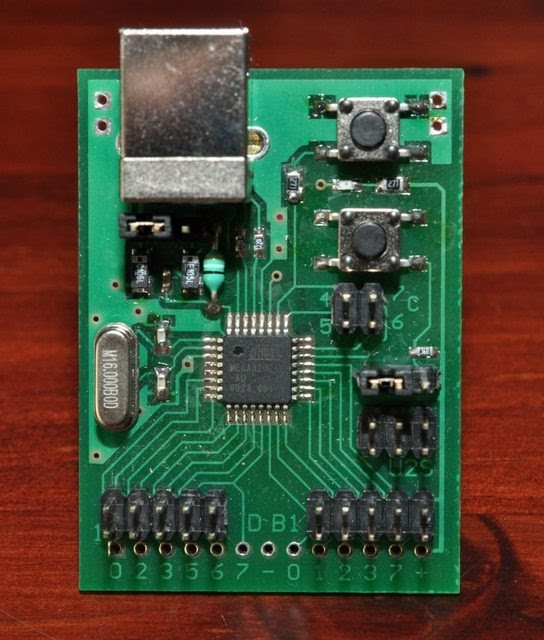

# U2S:

  
Artwork  

  
# Extension Boards
There are 20 sets of 3 extension boards available, a HVPP board, a level translator board and a pinout adapter board for common Atmel pinouts. Thanks to megal0maniac for taking these highres photos :)  
  
HVPP/HVSP board (ST662)  

  
Level translator board (GTL2000DL)  

  
Programming pinout adapter (TPI,PDI,ISP,JTAG)  

  
Full stack  

  
Artwork  

  
## Homemade artwork:

  

