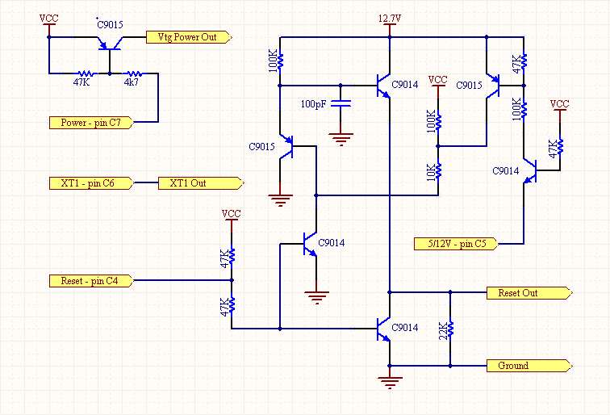
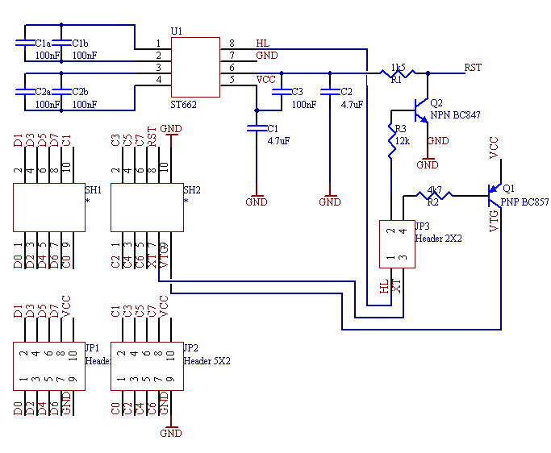

# STK500  
The STK500 is in module 0x82.  
It supports STK500 compatible ISP,HVPP & HVSP protocols.  
For avrdude use  -P /dev/ttyACM0  and  -c  stk500v2 for ISP,  stk500pp for HVPP,  stk500hvsp for HVSP  
  
## Connecting ISP  
  
Connect MOSI to MOSI and MISO to MISO, DO NOT cross it over.  
RST, VCC,GND and SCK must be connected as well, see the U2S pinout.  
The ISP header can either be IN or OUT, it is solder bridged to OUT by default.  
There is a clock output on PB7, it can be turned on in the AVRStudio programming dialog.  
Only turn it on when using ISP mode, it MUST be off when doing HVPP/HVSP.  
ISP programming mode supports automagic temporary debugWire disabling,  
there must be a 10k pullup connected to the reset line for this to work.  
  
## Connecting HVPP  
  
PORTD is connected to the data pins on the AVR.  
PORTB is connected to the control pins on the AVR.  
VCC, RST and XT1 is obtained from the circuit below.  
  
Control mapping for most AVR's.  
  
B0 - BS2  
B1 - RDY  
B2 - /OE  
B3 - /WR  
B4 - BS1  
B5 - XA0  
B6 - XA1  
B7 - PL  
  
Control mapping for ATtiny26/261/461/861  
  
B0 - nc  
B1 - nc  
B2 - /WR  
B3 - XA0  
B4 - XA1/BS2  
B5 - PL/BS1  
B6 - RDY  
B7 - /OE  
  
Control mapping for ATtiny2313  
  
B0 - nc  
B1 - RDY  
B2 - /OE  
B3 - /WR  
B4 - BS1/PL  
B5 - XA0  
B6 - XA1/BS2  
B7 - nc  
  
## Connecting HVSP  
  
VCC, RST and XT1 is obtained from the circuit below.  
  
D0 - SDI  
D1 - SII  
D2 - SDO  
  
In addition ATtiny24/44/84 needs prog\_enable pins.  
  
B0 - PE0  
B1 - PE1  
B2 - PE2  
  
## Discrete HVPP/HVSP Circuit  
  
  
  
DO TEST IT SEPARATELY FIRST,  12V can damage an AVR.  
External 12.7V required, although 11.8V seems to work. (from a 7812)  
For extra safety a 1k5 resistor can be connected between Reset Out and the target.  
Any general purpose transistors should work.  
  
The pinouts are the same as the Dragon and STK500, D = Data and B = Control.  
C4 - 0 = Reset High    ---  1 = Reset Low  
C5 - 0 = 12V to Reset ---  1 = 5V to Reset  
C6 - 0 = Connect to XT1 on target AVR  
C7 - 0 = Sets Vtg = Vcc  ---  1 = Sets Vtg = 0V  
  
## ST662 HVPP/HVSP Circuit  
  
The top pinout is the same as the dragon. Only the ST662 part can be built and the control and data lines connected directly to the U2S board if so desired.  
Below the pcb artwork can be downloaded, it is at 600dpi and is already flipped.  
In V2 a 4k7 pullup is added to PORTC4 (pin2 on JP3) to FIX startup mode.  
The 12k R3 interfered with the select switch....  
  
C1 and C2 is 1210 Size A tantalum caps, R1 is 0805 and the rest 0603.  

[PCB artwork](files/HVPP_ST662_600dpi.png)  
  
  
  
