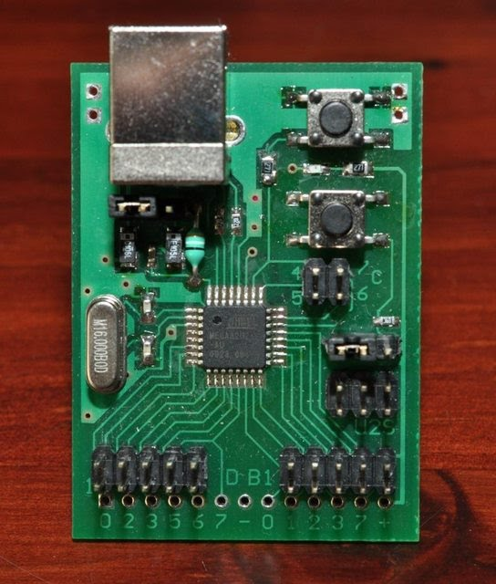

# MegaU2S

This a dev board with a builtin bootloader and USB CDC driver that can also program other AVR chips. There are a few [modules](Documentation/Modules.md) loaded high in flash just below the bootloader and 23kB left for your application code.  
I have about 80 of these left.  

